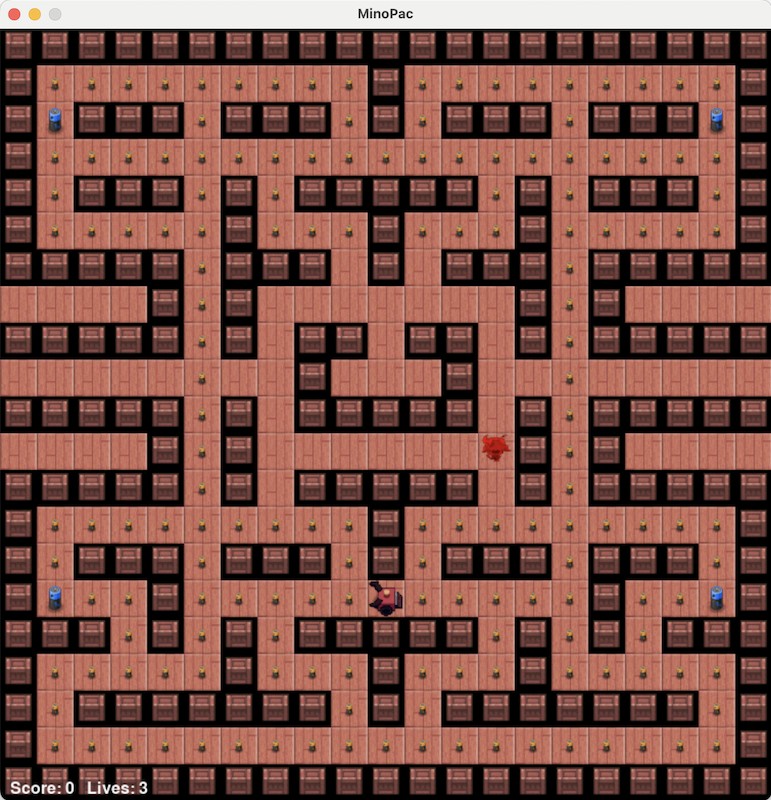

# Assignment 2 for XB 0145: Introduction to Python Programming for AI

In this assignment, you will recreate a classic arcade-style gameplay using Python 👾. 
You will implement enemy entities with distinct behaviors, movement patterns, and interactions, similar to classic maze games. 
The assignment guides you through bringing AI-controlled characters back into a simple clone of the classic game Pacman ([https://freepacman.org](https://freepacman.org)), programming their decision-making logic, and adding support for loading new maze layouts.

---
## Preliminaries
If you have not yet installed git, please follow [this link](https://git-scm.com). On the page click install and follow the instructions.

To get started, let's **clone the repository**, and set up our programming environment.
Execute the following commands in your terminal where you want to create a folder for the assignment:
```bash
git clone <repo_url>
cd minopac
conda activate <use the same environment you created for MinoBot (assignment 1) >
```
--- 
### Project Structure
The project is structured as follows:
```
└── 📁MinoPac
    └── 📁assets
        ├── MinoPac.png
    └── 📁levels
        ├── broken_missing_player.txt
        ├── broken_ragged.txt
        ├── maze_wrap.txt
        ├── movement_sandbox.txt
    └── 📁minopac
        └── 📁assets
        └── 📁entities
            ├── __init__.py
            ├── ghost.py
            ├── player.py
        ├── constants.py
        ├── game.py
        ├── maze.py
        ├── sprites.py
        ├── vector.py
    ├── ASSIGNMENT.md
    ├── main.py
    ├── README.md
```


- `minopac/`: The main game code.
- `minopac/entities/`: Game entities like the player and ghosts.
- `minopac/game.py`: The main game loop.
- `minopac/graphics.py`: Pygame setup and drawing utilities.
- `minopac/levels/`: Level layouts and loading logic.


---
## 0. Warm-Up: Observe and Play

The goal of this step is to get familiar with the environment and the existing code.
To do so, please follow the next steps:
- Run `python main.py` in your terminal to start the game. To control the character, you can use the arrow keys (or WASD) to move the MinoBot around the maze. The goal of the game is to collect all the pellets (small dots) spread throughout the maze.
- When you run the game, you should see the following screen. 
- You win the game when you eat every pellet on the map and the maze is cleared, and you have no more pellets to collect.
- Currently, the game is a bit boring because there is no danger for Minobot; they can collect all the pellets. Therefore, now it's time for you to implement the ghosts 👾

### Core Concepts

Think of MinoPac like a flipbook animation: it moves forward step by step, showing one "frame" (moment of time) at a time. This is similar to how a movie is made from many still frames shown quickly one after another.
In the game, two important functions keep things running smoothly:
- **`Game.update`**: This function is responsible for moving the characters, checking for events (like a pellet being eaten or a player bumping into a wall), and making changes to the game state.
- **`Game.draw`**: This function updates what you _see_ on the screen: like re-drawing the player in a new position or showing changes to the maze.

For now, here's how it works:
The player only moves after finishing their step into a new grid cell. This happens when the method `Player._try_start_move` is triggered. In simpler terms, it makes sure the player "snaps" to the center of a tile before starting their next move. Soon ghosts will behave in exactly the same way.
Take some time to understand how this loop works now, it might seem tricky, but once you get the hang of it, adding new game features (like moving ghosts or making walls affect movement) will be much easier. Don't stress! You’ll be guided step by step through this process.

---

## 1. Draw a Practice Ghost (`# TODO: Draw the Ghosts here`)
When working on projects like this, it's always a good idea to start small and focus on displaying something visible on the screen. That way, you can quickly confirm that your setup is working correctly before diving into more complex logic.

For now, let's start by getting our ghost to show up on the screen! This is a great first step to make sure everything is running as expected.

In this section, we will be mainly working on `minopac/game.py` where we defined the `Game` class.

**Steps:**

1. Open the file `minopac/game.py`.
2. Read this file from top to bottom. Identify the classes and methods defined in this file.
3. find the `def draw(self):` method within the `Game` class.
4. In the `draw(self)` method, locate the line where the player is drawn:
   ```python
   self.player.draw(self.screen)
   ```
5. Immediately after that line, insert the following code **(make sure indentation matches the surrounding code)**:

   ```python
   # Draw a placeholder ghost at (13, 11)
   ghost_surface = get_ghost_sprite((255, 0, 0))
   ghost_pos = self.maze.grid_to_pixel((13, 11))
   ghost_rect = ghost_surface.get_rect(center=ghost_pos)
   self.screen.blit(ghost_surface, ghost_pos)
   ```

After saving, run the game (so `python main.py`). You should see a ghost near the center of the screen, unmoving, as you play.


### Core Concepts
So what is going on here? 

The code you just added displays a ghost at a specific location in the maze: at grid coordinates (13, 11). Here’s a breakdown:

- `get_ghost_sprite()` fetches and returns the image (sprite) representing a ghost.
- `self.maze.grid_to_pixel((13, 11))` converts the grid coordinates (which refer to a tile in the maze) into pixel coordinates on the PyGame screen. This ensures the ghost appears at the right spot.
- `ghost_surface.get_rect(center=ghost_pos)` creates a rectangle representing where to draw the sprite, centered on that pixel position.
- `self.screen.blit(ghost_surface, ghost_rect)` draws the sprite onto the screen at that calculated position.

The result: every frame, a single ghost appears near the middle of the maze and never moves. This is a “hard-coded” or placeholder ghost to confirm that the drawing logic works before we make ghosts real game entities.
 
This step is crucial in game development: it's much easier to debug movement and logic once you’re sure the visuals appear where you expect. 
Once we know drawing works, we will move on to controlling the ghost's behaviour (position and state) in later steps.


---

## 2. Build and Draw the First Real Ghost (`# TODO: Implement the Ghost class`)
Files: `minopac/entities/ghost.py`, `minopac/game.py`.

Just like Step 1, we’ll focus on getting something visible as quickly as possible, only this time the ghost will already live inside its own class. This keeps the feedback loop tight: you write the ghost, you spawn it in the game, and you immediately see it render.

**Steps:**

1. Open `minopac/entities/ghost.py` and create the `Ghost` class. In `__init__`, you can do things similar to `Player` and set some important information: maze reference, spawn tile, `grid_pos`, `pixel_pos`, `movement_speed`. You can get the starting position using `maze.next_ghost_spawn_location`.
2. Add a simple `draw(surface)` method that should have almost exactly the same code as in our placeholder in the previous step. Remember to use the instance attributes where necessary: this function should draw this particular ghost.
3. Switch over to `minopac/game.py` and replace `# TODO: Add the Ghosts here` with `self.ghosts = [Ghost(self.maze, spawn_tile)]` using the maze’s ghost spawn location `Maze.next_ghost_spawn_location`.
4. In `Game.draw`, right after `self.player.draw(self.screen)`, loop over `self.ghosts` and call `ghost.draw(self.screen)`. This should replace the placeholder code from Step 1.
5. Run `python main.py`. You should now see the ghost class you just wrote being drawn through the actual game loop instead of the hard-coded sample.

### Core Concepts
Keep the workflow observational: you’ve already proven the screen can show a ghost, so now you’re just swapping in the real object. Matching the player’s attribute layout now prevents difficult refactors later when ghosts start moving.

---

## 3. Make the Ghost Move, Then Think (`# TODO: Update/Plan the Ghost`)
Files: `minopac/entities/ghost.py`, `minopac/game.py`.

With drawing sorted, give the ghost life. Start with motion that ignores walls so you can watch the animation work, then we can start adding decisionmaking that follows the structure of the level.

**Interpolation** in game movement refers to smoothly transitioning an entity's position between two points over time, rather than jumping instantly from one grid tile to the next. This creates fluid motion (like gliding or sliding) by calculating a position partway between the previous and next locations, based on how much of the movement time has elapsed. In code, this is often done using a "lerp" (linear interpolation) function to blend between start and end positions proportionally. You can see an example of this in the `Player` class. The interpolation is done using a variable called `dt`, which stands for delta time, which in turn stands for the amount of time that passed between frames.

**Steps (Movement First):**

1. Back in `Ghost`, implement `update(self, dt)` by copying the interpolation logic from `Player.update`. Track a timer per move, lerp between `target_grid_pos` and `grid_pos` with `maze.interpolate_pixel_position` to find the new `pixel_pos`.
2. Temporarily let the ghost ignore walls: hard-code it to always move to the right. Set the direction and use `maze.get_cell_in_direction` after completing a move to set the new `target_grid_pos`. The maze class already takes care of wrapping the screen so it should loop endlessly.
3. Hook this into the game loop by replacing `# TODO: Update the Ghosts here` inside `Game.update` with a loop that calls `ghost.update(dt)` for every ghost. Run the game: the ghost should now glide smoothly even without brains.

**Steps (Planning and Walls):**

4. Introduce `plan_next_move(self, player)` to the `Ghost` class. Use the maze to ask which neighboring tiles are open. This means that for navigation logic we will use the grid coordinates. The logic to choose a move could be as complex as you want, for now set the ghost direction towards any tile next to it without a wall. We will start using the location of the player to make decisions later.
5. Hook this up into the game loop by replacing `# TODO: Handle Ghost decision-making here` inside `Game.update` with some logic that calls this function for every ghost that is ready to make a move (a ghost is ready to make a move when it just completed a move between grid cells).
6. Update your move picking logic, start with a simple rule: keep going straight if possible; if a wall blocks the way, pick the first open direction (for example, reverse). This already creates believable patrols.

### Core Concepts
Movement and decision-making happen at different speeds: the ghost “thinks” once per tile (when `plan_next_move` runs) but “moves” every frame (`update`). Separating these keeps animation smooth no matter the frame rate. 

---

## Important!

This point in the assignment marks a significant change in the type of instructions you will receive. Instructions so far have been quite explicit: you have been told where to add code, what to call functions and variables, and which attributes to update. This should have gotten you accustomed to the different components within this package. From this point on instructions will (mostly) only specify the desired behavior and it is up to you to decide how and where to implement this. You are allowed to create new classes, methods, files or even rewrite existing logic if you think that will help you (although it's not necessary to rewrite anything!).

## 4. Collisions, Fright Mode, and Respawns (`# TODO: Frighten/Reset/Collide`)
Files: `minopac/game.py`, `minopac/entities/ghost.py`.

Now that ghosts can move intelligently, they need to interact with the player. This step wires up collision checks, frightened behavior triggered by power pellets, and the reset flow after any encounter. After the step this game really should feel like Pac-Man.

**Steps:**

1. Decide how to detect contact: for example you can measure the distance between `player.pixel_pos` and `ghost.pixel_pos`. Pick a strategy so a collision triggers the moment the visuals overlap. Drop this logic into `Game.check_collisions` and call it every frame.
2. When a normal ghost touches the player, subtract a life, and respawn everyone so both sides start fresh. Make sure timers, directions, and pending moves all clear; otherwise ghosts might immediately collide again after the reset.
3. Power pellets should flip ghosts into a frightened state for as long as the timer is running. In this mode they slow down, turn blue (or another color), and avoid the player. They will stay in this state until the timer expires. The game class already has some code handling power pellets, so take a look there.
4. Colliding with a frightened ghost should award points and switch that ghost into an “eaten” state where it dashes back to the spawn house to recover. Upon reaching the spawn, it should quietly transition out of the eaten state and resume the usual chase logic.
5. Whenever the player loses a life or restarts the level, every ghost should reset to its spawn with normal speed, no frightened flag, and clean movement timers. Consistency here prevents edge cases where a ghost stays frightened forever or resumes mid-path.

### Core Concepts
Collisions make movement matter. Frightened mode layers a temporary state machine on top of the base ghost behavior: normal → frightened → eaten → respawn. Keeping timers and flags on the ghost itself avoids cluttering `Game`, and resetting the same way each time guarantees consistent behavior after every encounter. Spend time getting the collision math right, misaligned hitboxes are the most common source of “I swear I wasn’t touching that ghost!” frustration.

---

## 5. Give Each Ghost a Personality (Inheritance + TODOs Above)
Files: `minopac/entities/ghost.py`, `minopac/game.py`.

With collisions working, it’s time to bring back the classic cast. You’ll keep all shared behavior inside `Ghost` and create lightweight subclasses that only tweak how the next tile is chosen. Think of it as giving each ghost a different “targeting instinct.”

**Tips:**
- Note that you can use `get_ghost_sprite((250, 0, 0))` to get a red tinted ghost sprite, play around with the three numbers to get different colors. This way you can distinguish between the different ghosts.
- For implementing more difficult behavior notice that there is `Maze.find_shortest_path`. Which will give you a list of all the cells that contain the shortest path from and to two target cells.

**Steps:**

1. Create `ChaserGhost(Ghost)` whose simply targets `player.grid_pos`. Instantiate one in `Game.__init__` so you can watch it doggedly follow the player.
2. Create `AmbushGhost(Ghost)` that looks a few tiles ahead of the player using `player.direction`. Spawn it and confirm it tries to cut you off instead of trailing directly.
3. Create `RandomGhost(Ghost)` that picks a random option from `_valid_options`, preferably avoiding immediate backtracking. This ghost keeps runs unpredictable, so test a few rounds to make sure it never walks through walls.
4. Create `SpeedUpGhost(Ghost)` that moves at half speed (double the move time) and slowly speeds up over the course of the game. You can choose to implement this speedup with time or pelettes eaten.
5. Update the constructor TODO to spawn all four ghosts, reset them alongside the player, and run a full playtest to ensure frightened mode, collisions, and resets still behave with multiple personalities on screen.

### Core Concepts
Inheritance keeps the physics identical while letting each subclass alter the “brain” portion. This isolates what changes (target selection, speed tweaks) from what stays the same (movement pipeline, frightened/eaten handling). The four behaviors also provide natural play-testing checkpoints: as soon as one ghost feels off, you know exactly which subclass to inspect.

| Ghost        | Personality Cue                                  |
|--------------|--------------------------------------------------|
| `ChaserGhost`| Locks onto the player’s current tile             |
| `AmbushGhost`| Targets a few tiles ahead of the player’s facing |
| `RandomGhost`| Chooses a random valid direction each decision   |
| `SpeedUpGhost`| Starts slow and accelerates over time           |

---

## 6. Load Levels From Files
Replace the hard-coded `LEVEL_LAYOUT` with file-driven layouts. The repo already includes `levels/movement_sandbox.txt` and `levels/maze_wrap.txt` as functional alternatives plus `levels/broken_missing_player.txt` and `levels/broken_ragged.txt` that should trigger validation errors..

### Core Concepts
Reading level data from files demonstrates defensive programming: you must trust but verify user content. By validating rectangles, spawn markers, and error conditions, you prevent cryptic crashes and can surface friendly messages instead. This workflow mirrors real games that ship with modding support or level editors.

### Steps

1. **Character Legend:**
   - `#` = wall
   - `.` = pellet
   - `o` = power pellet
   - `P` = player start
   - `G` = ghost start
   - ` ` (space) = empty floor

2. **Create `levels/level1.txt`:**
   - Copy the existing hardcoded maze layout into `levels/level1.txt`.
   - Manually edit a few tiles (change/add a ghost spawn, move the player) so you can test correct loading.

3. **Write the Loader (`load_level`):**
   - Read the file lines, stripping trailing newlines.
   - Check that all lines are the same length (rectangular shape).
   - Make sure that there are no unknown characters.
   - Verify at least one player start (`P`) and at least one ghost start (`G`) exists.
   - Raise a clear ValueError on shape errors or missing required tiles.
   - Catch FileNotFoundError and give a user-friendly message.

4. **Use the Loader in `Game`:**
   - In `Game.__init__`, instead of using the old `LEVEL_LAYOUT`, call `load_level("levels/level1.txt")`.
   - Pass the returned list of strings to `Maze.from_strings`.

5. **Test Error Cases:**
   - Temporarily point the loader to `levels/broken_missing_player.txt` and `levels/broken_ragged.txt`.
   - Check that your code raises a helpful error explaining what’s wrong (missing player or ragged lines) instead of a crash.

6. **Restore and Verify:**
   - Switch back to a valid file.
   - Restart the game; the on-screen maze should exactly match the contents of your chosen file.

**Goal:** The game should always use the map layout found in the file, and any formatting mistakes should trigger a specific, readable error message for the user.

---

## 7. Bonus Goals (if you feel like it)
- Make things look prettier! You can add animations that indicate that the frightened mode is almost finished, or anything you think that would give to game more juice.
- Come up with a ghost subtype of your own! Maybe it can have special powers like jumping over walls occasionally.
- Implement player AI! Create a common superclass for `Player` and split this into `AIPlayer` and `HumanPlayer`.


